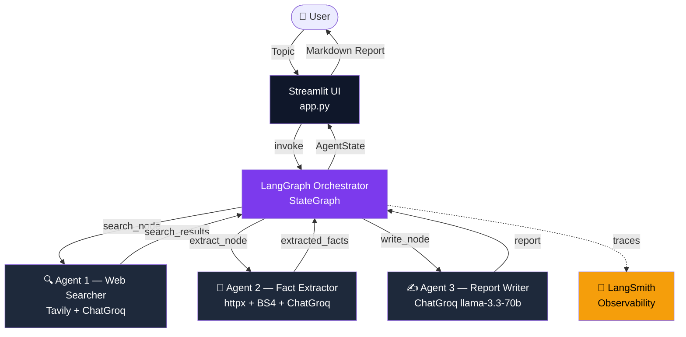

<div align="center">

# 🔭 MARS — Multi-Agent Research System

**Autonomous AI team for deep research & publication-ready reports**

[](https://python.org)
[](https://langchain-ai.github.io/langgraph/)
[](https://console.groq.com)
[](https://tavily.com)
[](https://streamlit.io)
[](https://smith.langchain.com)

*Enter a topic → three AI agents search the web, extract facts, and write a grounded report. Automatically.*

**[🚀 Live Demo](https://ajitabh-12-7-mk-1-app.streamlit.app)** · **[📝 Blog Post](#)** · **[📊 Architecture](#architecture)**


</div>

---

## What is MARS?

MARS coordinates three specialised AI agents in a strict sequential pipeline. No hallucination — every sentence in the final report is sourced from a URL that was fetched and verified.

```
User Topic  →  [🔍 Searcher]  →  [📄 Extractor]  →  [✍️ Writer]  →  Report
```

| Agent | Tools | Responsibility |
|---|---|---|
| 🔍 **Web Searcher** | Tavily API + Groq LLM | Refines query, searches web, returns top 10 sources |
| 📄 **Fact Extractor** | httpx + BeautifulSoup4 + Groq LLM | Fetches pages, strips boilerplate, extracts key facts |
| ✍️ **Report Writer** | Groq LLM (llama-3.3-70b) | Synthesises a structured, citation-backed markdown report |

---

## Architecture



**Key design decisions:**

- **LangGraph over CrewAI/AutoGen** — Graph-based state model with explicit transitions. Every `search_results → extracted_facts → report` handoff is typed and inspectable in LangSmith.
- **Groq (free)** over OpenAI — `llama-3.3-70b-versatile` at 0 cost, ~300 tok/sec, one import swap from `ChatOpenAI`.
- **Tavily** over SerpAPI — Built for LLM agents. Returns clean structured results, not raw HTML scraped pages.
- **Streamlit** for UI — Fastest path to a public live URL for a portfolio project. React/Framer Motion planned for v2.

---

## Real Engineering Challenges I Solved

> *The stuff that doesn't make it into tutorials — but is what employers actually want to see.*

### 1. Groq Rate Limit Hell (30 RPM on free tier)
The pipeline calls the LLM **three times** per run (query refinement, fact extraction, report writing). On Groq's free tier that's 30 requests/minute. Early runs crashed with `429 Too Many Requests` mid-pipeline after the first two agents.

**Fix:** Explicit `time.sleep(2)` between agent transitions in `orchestrator.py` + exponential backoff starting at 4s on 429:
```python
for attempt in range(MAX_RETRIES):
    try:
        return llm.invoke(messages)
    except Exception as e:
        if "429" in str(e):
            wait = BACKOFF_BASE ** attempt
            time.sleep(wait)
```

### 2. Playwright vs httpx — When to Use Which
Simple `httpx.get()` fails silently on JS-rendered pages (React SPAs, Next.js sites). The extractor returned empty strings for ~30% of URLs in early testing.

**Fix:** Two-stage fetching — httpx first, Playwright as fallback only when the response body is too short (< 500 chars):
```python
text = await _fetch_httpx(url)
if len(text) < 500:
    text = await _fetch_playwright(url)
```

### 3. LLM Hallucination in Reports
Early writer prompts produced confident-sounding reports with facts that weren't in the extracted data. Classic LLM behaviour.

**Fix:** Grounding prompt with hard constraints — the writer is only allowed to use verbatim facts from the `_build_facts_block()` output:
```
STRICT RULE: Only use facts from the FACTS BLOCK below.
Do NOT add anything from your training data.
If a fact is not in the block, do not write it.
```

### 4. BeautifulSoup Parser Compatibility
`lxml` (the fastest BS4 parser) requires Microsoft C++ Build Tools on Windows — a 4GB download that's unreasonable to require. Most tutorials assume Linux.

**Fix:** Switched to Python's built-in `html.parser` — slower but zero dependencies, works on all platforms:
```python
soup = BeautifulSoup(html, "html.parser")  # No C++ Build Tools needed
```

---

## Quickstart

### 1. Clone
```bash
git clone https://github.com/Ajitabh-12-7/MK-1.git
cd MK-1
```

### 2. Virtual environment
```powershell
# Windows
python -m venv .venv
.venv\Scripts\Activate
```

### 3. Install
```bash
pip install -r requirements.txt
python -m playwright install chromium   # optional
```

### 4. Configure API keys
```bash
copy .env.example .env
# Edit .env — add GROQ_API_KEY, TAVILY_API_KEY, LANGCHAIN_API_KEY
```

### 5. Run
```bash
python -m streamlit run app.py
```
Open **http://localhost:8501**

---

## Free API Keys

| Key | Link | Free Tier |
|---|---|---|
| `GROQ_API_KEY` | [console.groq.com](https://console.groq.com) | 30 RPM, 14,400 req/day |
| `TAVILY_API_KEY` | [app.tavily.com](https://app.tavily.com) | 1,000 searches/month |
| `LANGCHAIN_API_KEY` | [smith.langchain.com](https://smith.langchain.com) | Free tracing tier |

---

## Tech Stack

| Layer | Technology |
|---|---|
| Agent Framework | LangGraph 0.2.x |
| LLM | Groq + llama-3.3-70b-versatile |
| Web Search | Tavily Python SDK |
| Web Scraping | httpx + BeautifulSoup4 + Playwright |
| UI | Streamlit 1.35+ |
| Observability | LangSmith |
| Hosting | Streamlit Community Cloud |

---

## Project Structure

```
MK-1/
├── app.py               # Streamlit UI (dark glassmorphic design)
├── orchestrator.py      # LangGraph StateGraph pipeline
├── config.py            # Centralised env/key loading
├── requirements.txt
├── .env.example
├── .streamlit/
│   └── config.toml      # Dark theme config
├── agents/
│   ├── searcher.py      # Agent 1 — Web Searcher
│   ├── extractor.py     # Agent 2 — Fact Extractor
│   └── writer.py        # Agent 3 — Report Writer
└── tests/
    └── test_pipeline.py # Unit + integration tests
```

---

## Author

**Ajitabh Mishra** · 

<div align="center">
<sub>LangGraph · Groq · Tavily · Streamlit · LangSmith</sub>
</div>
